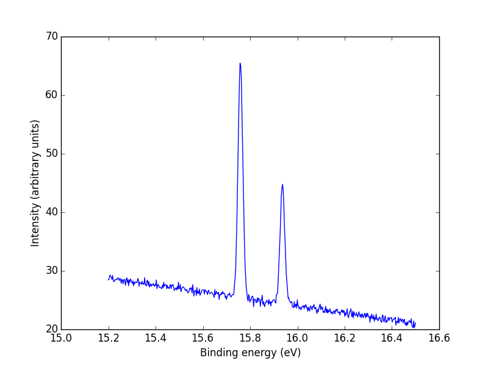

# Taavin_portfolio
Data analysis portfolio

# [Project 1: HoliSoils soil respiration dataset](https://github.com/kupilata/HoliSoils_soil_respiration_dataset)

## HoliSoils_soil_respiration_dataset
This project was part of HoliSoils (https://holisoils.eu/)
Combining data from different sources to form one large dataset. Includes recoding of the data and descriptive analysis.

### Source of data
Data has been extracted from a few different databases or directly from partners who gathered the data. 

### Processes
1. We combined all of this data in uniform dataset.
2. We did descriptive analysis and plotting of the data to make sure the observed values were all in the same units.
3. Descriptive analysis was also done to see what covariates are missing.
4. Missing covariates were added.
5. Treatments were coded uniformly.

### Publications
This dataset was published on Zenodo (https://zenodo.org/records/17519671)

# [Project 2: Licor data cleaning](link)

# [Project 3: EuropeanHarvestTask](https://github.com/kupilata/EuropeanHarvestsTask)

In this file you can find instructions on how to run geospatial analysis on Viana-Soto & Senf (2024) European Forest Distrurbance Atlas (EFDA) raster data.
The main purpose of the analysis is to calculate descriptive values for harvest regimes in 1x1 degree latitude/longitude grids across europe that match those of Suvanto et al. (2025).

To run the calculations on Puhti, you need the following files in your working directory (e.g. /scratch/project..../)

## Subdirectory called "rasterdata/". In this directory you fill have the country specific files downloaded from https://doi.org/10.5281/zenodo.13333034

## R script called "laskentarutiini_kaikkimaat.R". This script includes definitions of all functions needed, packages to make the functions work and Global variables needed for the functions as well.

### Global variables: 
- COUNTRY_INFO is a dataframe of countries and the time window to be calculated. It is used by some of the functions to define the time window specifically for each country that is be calculated. Some of the countries have specified years that are same as in Suvanto et al. (2025) and some are filled from "rasterdata/" directory depending on what countries' data are downloaded.
- YEARS is a sequence of the years used to rename the raster files' levels.
- EUROPE_POLYGONS is a polygon dataframe that includes polygons for all countries in Europe. This is derived from the package "rnaturalearth".
- NAME_MAP is a character list with country names that deviate between rasterdata and the EUROPE_POLYGONS dataframe. This is used to match correct country's file with its corresponding polygon in the function "get_country_polygon".
- ALL_GRIDS is a vector file for the 1x1 degree lat/lon grids in Europe that Suvanto el al. (2025) also used in their analysis.

### Functions:
- ensure_same_crs(x, target): This function compares x's crs to target crs and projects x to target if they are different. Both x and target are expected to be terra SpatVector or SpatRaster objects.
- get_country_polygon(country_name, europe_sf): This function retrieves a country's polygon from EUROPE_POLYGONS. This function is designed to be used internally in the function get_country_grids().
- get_country_grids(country_name, all_grids): This function uses the country's polygon to cut out grids that intersect with the country polygon. These Grids are then later used as unit of measurement.
- get_country_raster(country_name, dist_agent, info_table, base_path): This function reads the specified raster file and filters it to match the time window of interest. The argument "dist_agent" can be given to either filter the raster to only include disturbances marked as "harvests" or all disturbances. It will return a raster file that has been filtered and only has values of 1 or 0 depending on the filer specified in "dist_agent".
- get_raster_values(raster, polygons): This function extracts raster values for each polygon nad returns a list of dataframes for each polygon. It is designed to be used with the country grids as polygons and rasters derived with get_country_raster().
- get_forest_mask(country_name, polygons, base_path): This function reads in forest mask that is part of the rasterdata. It filters the forest mask for each polygon and returns a list of dataframes with forest mask values of either 1 or NA. This function is designed to be used with the countrys grids as polygons.
- calculate_harvest_frequency(raster_vals, mask, type): This function calculates either harvest frequencies for each polygon defined as percentage of forest area harvested either for every year or a total for all years. This option can be chosen with argument type=c("annual", "total"). It is designed to be used with the extracted raster values and forest mask values from the previous functions get_raster_values() and get_forest_mask().
- get_severity_raster(country_name, harvest_raster, base_path, info_table): This function reads in disturbance severity raster file that has value of dNBR. It filters the rasterfile to only include pixels that are marked as harvested and excludes other disturbance agents. It returns the raster file for dNBR.
- calculate_annual_NBR_intensity(severity_raster, polygons, mask): This function extracts raster values for each polygon and calculates mean and standard deviation for each grid for each year of the time window of interest. It is designed to be used with the harvest_raster derived with get_severity_raster() and country grids as polygons derived with get_country_grids() and forest_mask derived with get_forest_mask(). It also returns number of harvests in the grid as well as weighted number of harvests that is based on the forest area.
- calculate_NBR_intensity_all_years(): This function does the same as the one above but instead it calculates a total amount for all years in the time window of interest.
			
### Packages:
terra, sf, rnaturalearth, dplyr, tidyr, tibble, purrr

### Main program:
This section is for testing purposes. It will only run if this script is called directly. If this script is called in another script with source("laskentarutiini_kaikkimaat.R"), this section will be ignored.

## R script called "laskentarutiini_NBR_ja_freq.R".
This script is the main script to be called for running with batch jobs.
- commandArgs(trailingOnly = TRUE) \\ maa <- args[1]: These 2 lines are used to get the input value (e.g. country name) from the batch job script. This way it can be defined in the batch job script and many countries can be calculated simultaneously.
- This script calls the functions defined in "laskentarutiini_kaikkimaat.R" to be used.
- In this script you can define what you want to calculate.
- This can be used to parallelise the calculations. Parallelisation require package called "parallel".
- To parallelise, wrap the funtion calls you want to use in a new function that is stored in wrapped list of functions. This can be then called to be run in parallel.
- In my example I am running the NBR and harvest_freq calculations in parallel, therefore use 2 cores.
- Define the number of cores used with mclapply() based of how many wrapper functions are used.

## Batch job script called "submit_job_parallel_eurooppa.sh".
This script defines the batch job.
1. It defines resourses needed for the job. With geospatial analysis usually a lot of RAM memory is needed. In my example where I calculated all of europe I used the maximum of 370GB of RAM per country. For more detail about resources and partitions see: https://docs.csc.fi/computing/running/batch-job-partitions/
  - Mandatory are at least: job-name, account, partition, time, ntasks, cpus-per-task, mem
  - recommended to also define: array (if doing parallel), output, gres
2. It defines the R environment used for the job. In our example this is r-env/442. Run command "module avail r" to see available R environments.
3. It defines the local directory to be used for writing and reading temporary files (see: SCRATCHDIR=$LOCAL_SCRATCH). This directory is needed to be defined in order to make use of the fast local storage space defined in the resource inquiry phase (see. "#SBATCH --gres=nvme:150").
4. It defines input values for the R script. Here we run all countires of Europe in parallel. This means the it will create a separate batch job for each country that is defined in "countries.txt". In our example this is defined in "COUNTRY=$(sed -n "${SLURM_ARRAY_TASK_ID}p" countries.txt)". If we parallelise like this, we also need to define the array size in the resource inquiry phase. See "#SBATCH --array=1-38", this creates 38 jobs, 1 for each country.
5. It defines what is being run. In our case we run the main script "laskentarutiini_NBR_ja_freq.R" (see: time Rscript laskentarutiini_NBR_ja_freq.R "$COUNTRY". This line runs the script using input as defined above "COUNTRY" and times the process.
6. Lastly it will print the script output to an output file defined in "#SBATCH --output=logs_europe/slurm_%x_%A_%a.out".
Including:
  - the actual script output
  - recourses used (see. sacct -j $SLURM_JOB_ID --format=JobID,MaxRSS,Elapsed,ReqMem,State)
  - end time for the scrip (see. echo "Job ended at: $(date)"

## List of countries to be analysed in a text file called:
countries.txt

## The results are written to a .csv file defined in the main script (laskentarutiini_NBR_ja_freq.R). 
Tulokset_lopullinen/

# [Project 4: Spectral Matters](https://github.com/kupilata/Sprectal_Matters)

#3 Sprectal_Matters
This is the final project called "Spectral Matters" for the course Elementary Programming in University of Oulu. This was created in the summer of 2024 and gave me the best grade of 5 in this course.

### Background
In electron spectroscopy matter is examined by radiating it with a bright light and measuring the kinetic energy of electrons that come off it. When the photonic energy of light and kinetic energy of the electrons are known, they can be used to derive the amount of force that was required to break off the electrons. This provides valuable information about the matter's electron structure, and its chemical and physical properties. This phenomenon where photons break off electrons is called photoionization, and the broken off electrons are called photoelectrons.
In this course project you'll learn how to read data into a program and how to perform small operations on the data, and how to plot data using Python libraries. Your task is to write a program for analyzing the photoionization spectrum of argon. For this purpose we have provided you with simulated data where argon atoms have been ionized and the kinetic energy of broken off electrons has been measured. 

### Program overview
The measurement has been performed multiple times, and each measurement session has been recorded into a different, numbered file. The file names are in the format measurement_i.txt. Each file contains rows of data with two floating point numbers. The first number on each line is the binding energy of electrons, derived from the measured kinetic energy (unit: electronvolt); the second number is the corresponding intensity (no specific unit; this described the amount of electrons measured with this particular binding energy). In each measurement file, the first column contains the same uniformly distributed binding energy values. Your program should add together the intensity values from each file. The purpose is to eliminate noise from the measurements. 

Due to the measuring equipment, the spectrum has a linear background. Aside from the obvious peaks it looks like a downward sloping line. The background signal that causes the sloping should be removed before analyzing the spectrum. This can be done by choosing two points from the spectrum and fitting a line between these points. After this, at each data point, values obtained from this line are subtracted from the measured intensity values.
When analyzing the spectrum our primary interest are the two rather obvious peaks in intensity; in particular, their relative intensity. The intensity of each peak is obtained by computing their area by obtaining its integral. This can obtained by using the trapezoidal rule to estimate the integral. According to theory the first peak should have approximately double the intensity of the second one.

### Program features
The program has the following features:
1. The program has a graphical user interface with all the features available for the user.
2. Load data: loads data from a user-specified location and reads it into program memory in a format that is suitable for processing. Should return one list for each column in the data. The first list should contain measured kinetic energy values (measurement points) and the second one the sums of all measurements for each row.
3. Plot data: this plots the current data (the user is prompted to load the data first if it hasn't been loaded yet). Data is plotted using matplotlib, but it is plotted inside the application window. The figure will look like the one below.
4. Remove linear background: removes the linear background from the data as described above. The user selects two points from the figure, and a line is fitted between these points. The line is then subtracted from the data. If there's no data in the program memory yet, the user is given an error message about it.
5. Calculate intensities: The intensity of peaks can be calculated. This is done with the trapz function from numpy. The use selects the interval by clicking on the figure. The result is printed somewhere inside the window. If there's no data in the program memory yet, the user is given an error message about it.
6. Save figure: this feature allows the user to save an image of the current plot. The user uses a separate dialog for select a filename and destination for saving the figure. matplotlib provides the necessary features to do this.

### About libraries
The course provided a library that is built on top of TkInter, and offers a heavily simplified interface to some of its features through functions. The library's docstrings describe how to use it. The lirary's main program also has a short example of how to make a simple interface. THIS IS NOT INCLUDED IN THIS REPOSITORY
